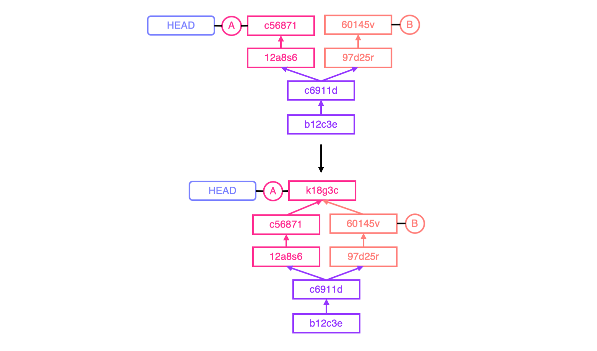
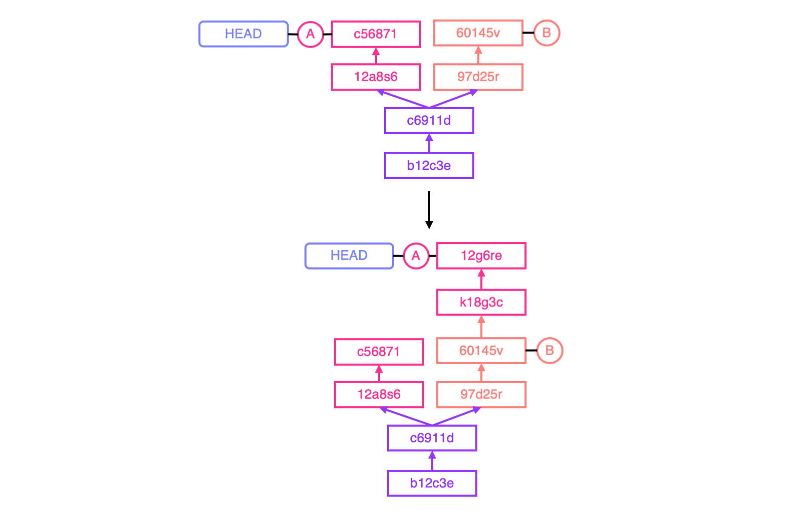

## Introduction
This document contains frequently used command and the corresponding used cases for version control framework Git. For simplification, all the variables are written in parenthesis, e.g. (files), (tags). The optional parameters are written in sqaure brackets, e.g. [--global], [--mixed]

&nbsp;
## Table of Content
* [Environment Setting](#environment-setting)
* [Basic Operations](#basic-operations)
* [View Changes](#view-changes)
* [Delete, Rename or Move Files](#delete-rename-or-move-files)
* [Branch](#branch)
* [Merge and Rebase](#merge-and-rebase)
* [Change HEAD or Branch](#checkout-and-reset)
* [Save File Temporarily](#stash)
* [Remote Control](#remote-control)

&nbsp;
## Environment Setting 
<sub>[Back to Top](#introduction)</sub>
#### Install Git on Mac
```
brew install git
```
#### Install Git on Linux (RHEL)
```
sudo yum install git
```
#### Install Git on Linux (Debian)
```
sudo apt-get install git
```

#### Set author profile globally
```
git config --global user.name  (name)
git config --global user.email (email)
```
#### Set author profile locally
```
git config --local user.name  (name)
git config --local user.email (email)
```
#### Initial Git repository
```
git init
```

&nbsp;
## Basic Operations
<sub>[Back to Top](#introduction)</sub>
#### Check current status of Git repository
```
git status
```
#### Staging local changes to Git repository
```
git add (files)
``` 
#### Staging all local changes (include rename and delete) to Git repository
```
git add --all
```
#### Record the staged changes to Git repository
```
git commit -m "(description)"
```
#### Add files to the latest commit (not recommended to amend remote repository)
```
git commit --amend --no-edit
```
#### Check commit history of Git repository or specific file
```
git log [--oneline] [--graph] [--pretty] [(file)]
```
#### Check SHA-1 information for each commit of Git repository
```
git reflog
```

&nbsp;
## View Changes
<sub>[Back to Top](#introduction)</sub>
#### View changes in every commit
```
git log -p [(files)]
```
#### View changes in specific commit
```
git show (commit.id)
```
#### View changes between working directory and commit
```
git diff (commit.id) [(file)]
```
#### View changes between two commit
```
git diff (commit.id.A) (commit.id.B) [(file)]
```
#### Check the who changes the file
```
git blame [-L (start,end)] (file)
```
####

&nbsp;
## Delete, Rename or Move Files
<sub>[Back to Top](#introduction)</sub>
#### Delete file and stage this operation
```
rm [files]
git add [files]
```
```
git rm [files]
```
#### Delete file from the repository, but keep it in the working directory
```
git rm --cached [files]
```
#### Rename or move files and stage this operation
```
mv (files] (new.file)
git add (files] (new.file)
```
```
git mv (files) (new.file)
```

&nbsp;
## Branch
<sub>[Back to Top](#introduction)</sub>
#### See current branches
```
git branch
```
#### Create branch
```
git branch [branch]
```
#### Delete branch
```
git branch -d [branch]
```
#### Change current branch
* all the staged changes will be __kept in staging area__
* all the local changes will be __kept in working directory__
```
git checkout [branch]
``` 

&nbsp;
## Merge and Rebase
<sub>[Back to Top](#introduction)</sub>
#### Merge

* create a new commit for branch A that merge branch A with branch B
* branch A will __fastforward__ to the commit made by branch B, if branch B is ahead of branch A
```
git checkout [branch.A]
git merge [branch.B]
```

#### Rebase

* create a new commit for branch A that merge branch A with branch B
* find the common root (c6911d) for branch A and branch B
* find the commit for A right after the common root (12a8s6).
* create a new commit (k18g3c) that merge the commit (12a8s6) with the latest commit of branch B (60145v)
* create a new commit (12g6re) that merge the commit (c56871) with the latest commit (k18g3c)
```
git checkout [branch.A]
git rebase [branch.B]
```
#### Deal with merge conflict
```
# edit the conflicted files
git add [files]
git commit
```
```
git checkout --ours [files]
git add [files]
git commit
```
```
git checkout --theirs [files]
git add [files]
git commit
```

&nbsp;
## Checkout and Reset
<sub>[Back to Top](#introduction)</sub>
#### Give up local changes and restore file to latest commit
```
git checkout HEAD [file]
```
#### General usage of checkout
* give up local changes
* restore all file content to specific commit 
* change HEAD to specific commit 
* this does not affect the branch, which is useful to compare the difference of files in different commit


```
git checkout [commit.id]
```
#### Undo git add for specific files
```
git reset [--mixed] [files]
```
#### Change HEAD and branch to specific commit (mixed mode)
* all the commited changes will be __kept in working directory__
* all the staged changes will be __kept in working directory__
* all the local changes will be __kept in working directory__
```
git reset [--mixed] [commit.id] 
```
#### Change HEAD and branch to specific commit (soft mode)
* all the commited changes will be __kept in staging area__
* all the staged changes will be __kept in working directory__
* all the local changes will be __kept in working directory__
```
git reset --soft [commit.id] 
```
#### Change HEAD and branch to specific commit (hard mode)
* all the commited changes will be __removed__
* all the staged changes will be __removed__
* all the local changes will be __removed__
```
git reset --hard [commit.id] 
```
&nbsp;
## Stash
<sub>[Back to Top](#introduction)</sub>
#### Save files temporary
* useful when you need to change the branch/commit in the middle of development
* the parameter __-u__ is used to stash the untracked files
```
git stash [-u]
```
#### Check stash status
```
git stash list
```
#### Restore files in stash
```
git stash apply stash@{[i]}
```
#### Delete files in stash
```
git stash drop stash@{[i]}
```
  
&nbsp;
## Remote Control
<sub>[Back to Top](#introduction)</sub>
#### Clone git repository
```
git clone (url) [(folder)]
```
#### Set alias for remote Git repository
```
git remote add (alias) (git.url)
```
#### Check remote Git repository urls and corresponding alias
```
git remote --verbose
```
#### Change remote Git repository urls for a specific alias
```
git remote set-url (alias) (new.git.url)
```
#### Update remote repository with changes in local repository
* update the remote branch with the local branch
```
git push (alias/url) (local.branch)[:(remote.brach)]
```
* update the remote branch and fixed the remote alias/url of pull/status for git repository
```
git push -u/--set-upstream (alias/url) (local.branch)[:(remote.brach)]
```
#### Fetch updated status from remote server
```
git fetch
git merge (alias/url)/(branch)
```
```
git pull [--rebase]
```
#### Remove remote branches
```
git push (alias/url) :(branch)
```